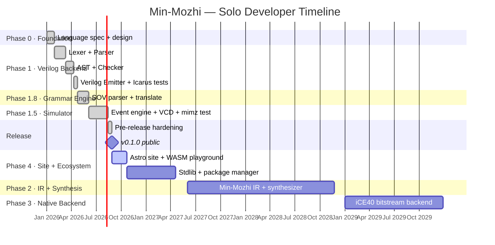
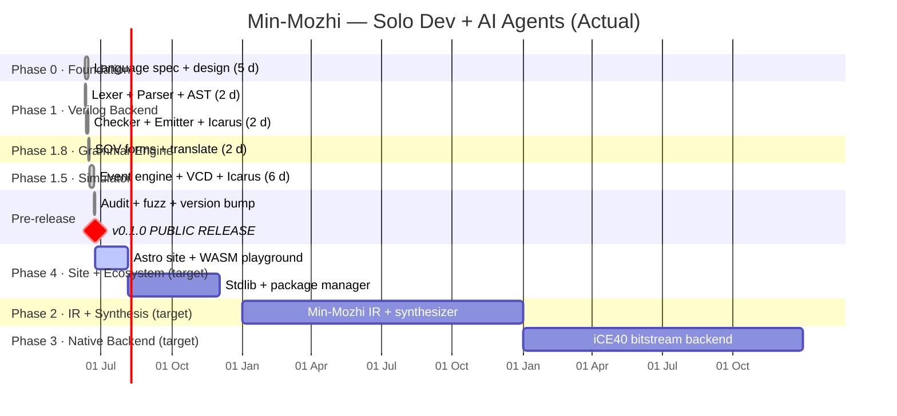

# Min-Mozhi (மின்மொழி) — Roadmap

> **"Language of Electricity"** — a modern, safe-by-default HDL, built to help
> students learn digital design, and the first Tamil-rooted Hardware Description
> Language.
>
> This file is the **public-facing summary**. Detailed task-level plans live in
> [`docs/plan/`](docs/plan/) (source of truth — see [`docs/RULES.md`](docs/RULES.md) R1/R2).
> Progress and decisions are logged in [`docs/log/`](docs/log/).

---

## Phase Status

| Phase | Name                              | Status                                   | Completed  |
| ----- | --------------------------------- | ---------------------------------------- | ---------- |
| 0     | Foundation & Spec                 | ✅ Complete                              | 2026-06-15 |
| 1     | Verilog Backend (compiler)        | ✅ Complete                              | 2026-06-12 |
| 1.8   | Grammar Engine (Tamil word order) | ✅ Complete                              | 2026-06-16 |
| 1.5   | Own Simulator                     | ✅ Complete                              | 2026-06-22 |
| **→** | **v0.1.0 public release**         | ✅ Complete                              | 2026-06-24 |
| 2     | IR + Synthesis (Yosys/nextpnr)    | 🟡 In progress (language-features track) | —          |
| 3     | Native FPGA bitstream             | ⏳ Planned                               | —          |
| 4     | Ecosystem, stdlib, community      | ⏳ Ongoing                               | —          |

---

## Phase Details

### Phase 0 — Foundation ✅ (2026-06-10 → 2026-06-15)

> Design before you code.

- Language goals and philosophy (`spec/01`) — education, safety, trilingual,
  full-stack ownership
- Full syntax and grammar design (`spec/02`) — EBNF, seven static safety rules
- Trilingual keyword system (`spec/03`) — English/Tanglish/Tamil skins, keyword
  set v1 frozen
- Grammar Engine design (`spec/04`) — `thamizh-order` SOV parser profile
- Compiler language chosen: **Rust** (static binary, sum types, miette diagnostics)
- Repo structure, docs system, dev-log discipline (`docs/RULES.md`)

### Phase 1 — Verilog Backend ✅ (2026-06-10 → 2026-06-12)

> Get something working end-to-end — done six months ahead of target.

- Lexer — trilingual, Unicode identifiers, `E10xx`
- Parser — full grammar, recursive-descent, `E11xx`, statement-level recovery
- AST — typed nodes, source spans
- Checker — six passes, all spec safety rules, `E02xx`–`E07xx`
- Verilog emitter — synthesizable Verilog-2005, `repeat` unrolling,
  Tamil→ASCII transliteration, `wire signed` / `reg signed`
- Icarus Verilog validation — every example linted and simulated
- LSP v0 — diagnostics-only language server + VS Code extension

### Phase 1.8 — Grammar Engine ✅ (2026-06-14 → 2026-06-16)

> Natural Tamil SOV word order — இலக்கண இயந்திரம்

- `thamizh-order` parser profile: `enil`-if, `pothu`-clocked, `thernthedu`-match
- `syntax thamizh` file-level directive
- `mimz translate --order code|thamizh`
- Tamil morphology helper for error messages (case suffixes on signal names)
- Native-authored error catalog (`lang/messages.toml`) — 33/36 codes

### Phase 1.5 — Simulator ✅ (2026-06-16 → 2026-06-22)

> Your own behavioral engine.

- In-house event-driven cycle simulator — no external tool at runtime
- `mimz sim` — clocked and combinational, `--in`, `--sweep`, `--cycles`,
  `--trace`, `-o file.vcd`
- `mimz test` — `tick`/`expect` test blocks, exit 0 = all pass
- Icarus differential: byte-for-byte match on all examples (`REQUIRE_IVERILOG=1`)
- VCD waveform output, viewable in GTKWave

### Phase 2 — IR + Synthesis 🟡 (2026-06-24 → ongoing) _(IR/synthesis target: 2028)_

> Own your middle layer.

Two tracks, running in parallel; see `docs/plan/phase-2-ir-synthesis.md` for
the full triaged backlog (source of truth).

**Language-features track — in progress:**

- ✅ Packages/namespacing (2026-07-02)
- ✅ `suzhal`/சுழல் bounded loop (2026-07-05)
- ✅ Tagged unions with payloads (2026-06-28)
- ✅ Interfaces/bundles + destructuring (2026-07-01)
- ✅ `default` assignments + item-level const-`if` (2026-06-30)
- ✅ `clog2` const-builtin (2026-06-27)
- ✅ Bundle-typed fn arg/return shape-checking (2026-07-11)
- ✅ `foreach` range/elements-form loop sugar (2026-07-13)
- Still open: enum variant construction syntax, structural
  interface matching, `?`/`??` valid-bundle sugar, channels tier (a), wire
  type inference, `pipeline(stages=N)`, `prove` blocks, G5 `secret`/
  `system_fault`

**IR/synthesis track — not started:**

- Min-Mozhi IR — own netlist-like intermediate format
- IR emitter from AST
- Logic synthesizer — map IR to gates (AND/OR/NOT/FF)
- Yosys integration or internals study for technology mapping
- FPGA primitive mapping (LUTs, flip-flops)

### Phase 3 — Native FPGA Backend _(target: 2029–2030)_

> Full end-to-end ownership.

- Target-specific backends per FPGA architecture
- Direct bitstream generation (iCE40 family — open and well documented)
- Optimizer passes: dead-signal elimination, constant folding
- Milestone: `mimz build blink.mimz --target ice40` → programs FPGA directly

### Phase 4 — Ecosystem _(ongoing from v0.1.0)_

> Make it usable by others.

- ✅ WASM browser playground (`crates/mimz-wasm`, CLI/WASM output parity tested)
- ✅ Documentation site (Astro, `site/`, deployed via `deploy-site.yml`)
- 🟡 Standard library — 5 modules shipped (fifo, pwm, uart_tx, seg7, debouncer); SPI/ALU common modules still open
- ⏳ Package manager for Min-Mozhi modules
- ⏳ npm / PyPI wrappers (thin — one Rust core, never reimplemented)
- ⏳ `mimz repl` — interactive REPL
- ⏳ `mimz tui` — no-IDE TUI workbench
- ⏳ Community + Tamil Nadu semiconductor outreach

---

## Timeline Graphs

> [!NOTE]
> All dates and durations below are **estimates only and subject to change**.
> Actual progress depends on scope changes, real-life constraints, and
> community contributions. Treat these as directional projections, not
> commitments.

Two projections are shown: **solo developer** (baseline) and **solo developer
with AI agents** (current mode). AI agents compress documentation, auditing,
and boilerplate tasks significantly; design and architecture decisions remain
human-paced.

### Version A — Solo Developer (no AI assist)

**Solo estimated milestones:**

| Milestone                 | Estimated date |
| ------------------------- | -------------- |
| Phase 0 complete          | Mar 2026       |
| Phase 1 complete          | Jun 2026       |
| Phase 1.8 complete        | Aug 2026       |
| Phase 1.5 complete        | Oct 2026       |
| v0.1.0 public             | Oct–Nov 2026   |
| Phase 4 site + playground | Jan 2027       |
| Phase 2 IR + synthesis    | Mid 2028       |
| Phase 3 native bitstream  | End 2029       |

---

### Version B — Solo Developer + AI Agents (actual)

> [!IMPORTANT]
> **All code in this project is human-monitored, reviewed, and verified.**
> Every AI-generated or AI-assisted piece was checked, corrected where needed,
> and signed off by the maintainer before it was accepted.

**AI-assisted actual milestones:**

| Milestone                 | Actual / Target date           | Speedup vs solo  |
| ------------------------- | ------------------------------ | ---------------- |
| Phase 0 complete          | 2026-06-15 (5 days)            | ~4× faster       |
| Phase 1 complete          | 2026-06-12 (2 days)            | ~6× faster       |
| Phase 1.8 complete        | 2026-06-16 (2 days)            | ~3× faster       |
| Phase 1.5 complete        | 2026-06-22 (6 days)            | ~5× faster       |
| v0.1.0 public             | **2026-06-24 (14 days total)** | **~4–5× faster** |
| Phase 4 site + playground | Aug 2026 (target)              | ~3× faster       |
| Phase 2 IR + synthesis    | End 2027 (target)              | ~2× faster       |
| Phase 3 native bitstream  | End 2028 (target)              | ~2× faster       |

> **Note:** The compression is largest for documentation-heavy and
> boilerplate-heavy phases (0, 1.8, pre-release). Architecture and compiler
> design phases (1, 2, 3) compress less because they are bottlenecked by human
> reasoning time, not writing time.

---

## Why Min-Mozhi Matters

| Dimension         | Significance                                                                                                                                                                                                                      |
| ----------------- | --------------------------------------------------------------------------------------------------------------------------------------------------------------------------------------------------------------------------------- |
| **Cultural**      | First Tamil-rooted HDL — anywhere in the world; brings native-language programming to Tamil-speaking students and grows Tamil as a language you can actually code in                                                              |
| **Education**     | Built from the ground up to teach digital design — compile a counter in 5 minutes, read errors that explain _what went wrong and how to fix it_, learn hardware thinking without fighting toolchain friction                      |
| **Safety**        | Every classic Verilog footgun — silent truncation, latch inference, multiple drivers, uninitialized registers, signed/unsigned confusion — is a compile-time error with a teaching diagnostic; safe by default, not by convention |
| **Modern Syntax** | Go/TypeScript-style braces and `: type` annotations, expression-oriented `if`/`match`, no `begin/end`, no preprocessor — a syntax that feels familiar to anyone who has written a modern programming language                     |
| **Technical**     | Full compiler stack from source to synthesizable Verilog, own event-driven simulator, LSP server, VS Code extension — a complete, self-contained toolchain                                                                        |
| **Timing**        | India's semiconductor boom — TATA, Vedanta fabs, India Semiconductor Mission — creates real demand for Tamil Nadu engineers who know HDL from day one                                                                             |
| **Community**     | Tamil Nadu has a growing VLSI and chip design ecosystem; Min-Mozhi is designed to lower the barrier for students entering it                                                                                                      |

---

## Deliverables at Each Phase

| Phase      | Description        | What you can show the world             |
| ---------- | ------------------ | --------------------------------------- |
| 0          | Foundation         | Language spec, grammar, GitHub repo     |
| 1          | Verilog Backend    | Working compiler — Min-Mozhi → Verilog  |
| 1.8        | Grammar Engine     | Tamil code in natural Tamil word order  |
| 1.5        | Simulator          | Own simulator with waveform output      |
| **v0.1.0** | **Public release** | **All of the above, open to the world** |
| 2          | IR + Synthesis     | FPGA bitstream via open toolchain       |
| 3          | Native Backend     | 100% native end-to-end compiler         |
| 4          | Ecosystem          | Community language with real users      |

---

_Min-Mozhi — மின்மொழி — Speak in Circuits_
